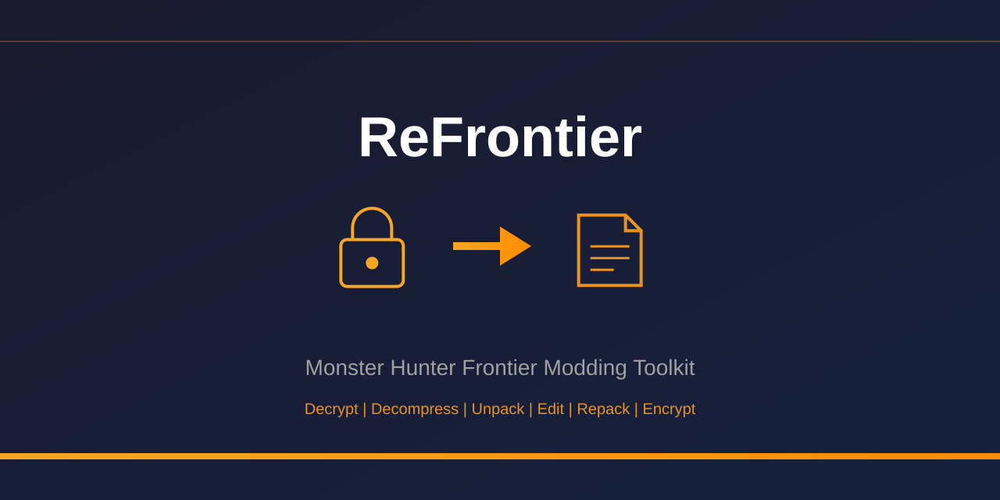

<p align="center">
  
</p>

# ReFrontier

[](https://github.com/Houmgaor/ReFrontier/actions/workflows/ci.yml)
[](https://dotnet.microsoft.com/download/dotnet/8.0)
[](https://github.com/Houmgaor/ReFrontier/releases)
[](LICENSE)

ReFrontier is a command-line toolset for modding Monster Hunter Frontier Online. It handles the full round-trip workflow: unpacking, decrypting, and decompressing game files for editing, then compressing, encrypting, and repacking them for use in-game.

## Features

Originally based on [mhvuze/ReFrontier](https://github.com/mhvuze/ReFrontier), ReFrontier has been extensively rewritten. Version 2.0 introduced breaking changes—see [MIGRATION_2.0.md](./MIGRATION_2.0.md) for upgrade instructions. You can use any release pre-2.0 for a version fully compatible with the original.

Key features:

- **Cross-platform**: Works on Windows, Linux, and macOS
- **Performance**: 4x faster single-threaded, with multithreaded unpacking support
- **Round-trip editing**: Full support for ECD/EXF encryption and FTXT text repacking
- **Single command**: Compress and encrypt files in one step
- **Reliability**: Fixed duplicate filename issues
- **Security**: Removed memory-unsafe code and outdated libraries
- **Text tools**: Improved CSV parsing and cleaner fulldump output
- **Stateful round-trip**: Extraction records how a file was packed, so rebuilding it is one command (`restore`), with no setup to remember
- **Safe by default**: Nothing you supplied is deleted, and the metadata needed to rebuild is always written
- **Task-based commands**: Each job is a verb (`unpack`, `restore`, `compress`…) carrying only the options that apply to it
- **Validation**: Non-destructive integrity checking of game files (`validate`)
- **Diff**: Structural comparison of two game files through encryption/compression layers (`diff`)

## Installation

Download the [latest release](https://github.com/Houmgaor/ReFrontier/releases) for your operating system.
Unzip the archive to find `ReFrontier.exe` (or `ReFrontier` on Linux/macOS).

To get the latest features, you can [build from source](#build).

## Usage

You can drag-and-drop files or folders onto the executable, or use the command line.

### Quick Start

1. Copy `mhfdat.bin` (or any file or folder) from the MHFrontier `dat/` folder to the same directory as the executable.

2. Decrypt and decompress the file:
    ```shell
    ./ReFrontier unpack mhfdat.bin
    ```

3. Edit the extracted data (see [tools](#see-also) and [included utilities](#data-editing)).

4. Rebuild the game file:
    ```shell
    ./ReFrontier restore mhfdat.bin.decd.bin
    ```

    The compression algorithm and encryption key come from the recipe written in step 2,
    so there is nothing to remember. See [Rebuilding](#rebuilding) for the details.

5. Replace the original `mhfdat.bin` with `output/mhfdat.bin`.

For detailed command reference, see [ReFrontier/README.md](./ReFrontier/README.md) or run:

```shell
./ReFrontier --help
```

### Commands

Each task is a command, and `--help` on a command lists only the options that apply to it:

| Command | Description |
|---------|-------------|
| `unpack <path>` | Decrypt, decompress and unpack a file or directory |
| `decrypt <file>` | Decrypt an ECD or EXF file without unpacking it |
| `pack <dir>` | Repack a directory produced by `unpack` |
| `restore <path>` | Rebuild a file using the recipe saved during extraction |
| `compress <file> --type <type>` | Compress a file with a JPK algorithm |
| `encrypt <file>` | Encrypt a file with the ECD algorithm |
| `validate <path>` | Check file integrity without writing output |
| `diff <a> <b>` | Structural comparison of two files |

```shell
./ReFrontier --help           # list the commands
./ReFrontier unpack --help    # options for one command
```

`--quiet`, `--verbose` and `--parallelism` work with every command.

Running `./ReFrontier mhfdat.bin` with no command still unpacks, as before.

<details>
<summary>Older flag-based form</summary>

Before 2.3.0 every task was a flag on a single command (`./ReFrontier mhfdat.bin --restore`).
Those flags still work, so existing scripts keep running, but the ones that select a task
now print the command to use instead and will be removed in a future release:

| Deprecated | Use |
|------------|-----|
| `--decryptOnly` | `decrypt` |
| `--pack` | `pack` |
| `--restore` | `restore` |
| `--validate` | `validate` |
| `--diff <file>` | `diff <a> <b>` |
| `--compress <type> --level <n>` | `compress --type <type> --level <n>` |
| `--encrypt` | `encrypt` |
| `--nonRecursive` | `unpack --flat` |
| `--ignoreJPK` | `unpack --keep-compressed` |
| `--noDecryption` | `unpack --keep-encrypted` |
| `--stageContainer` | `unpack --stage` |
| `--autoStage` | `unpack --auto-stage` |
| `--cleanUp` | `--clean` |
| `--noMeta` | `--no-meta` |

The renamed options are also accepted under their old spelling by the commands that take
them, so a script can move to the commands without renaming every option at once.

</details>

### Decryption

ReFrontier decrypts (ECD → JPK) and decompresses files by default.

Metadata needed for re-encryption is written automatically:
```shell
./ReFrontier decrypt mhfdat.bin
```

### Decompression

Decompression writes a new file beside the original and leaves the original in place.
Pass `--clean` to remove it instead.

Compressed files are identified by their `JKR` header (first bytes of the file).

```shell
./ReFrontier unpack mhfdat.bin  # Decompress if already decrypted
```

### Data Editing

Once files are decrypted and decompressed, you can edit them using:

- [FrontierTextTool](./FrontierTextTool/README.md) - Extract and modify game text
- [FrontierDataTool](./FrontierDataTool/README.md) - Extract and modify game data structures
- External tools listed in [See Also](#see-also)

### Rebuilding

Extracting writes an *extraction recipe* next to the original file,
recording every transformation that was undone:

```json
{
  "Version": 2,
  "SourceFile": "mhfdat.bin",
  "ExtractedFile": "mhfdat.bin.decd.bin",
  "Layers": [
    { "Kind": "Ecd", "MetaFile": "mhfdat.bin.meta",
      "Header": "ZWNkGgQA2YVlCAAAms5C4Q==", "OriginalSize": 7383160 },
    { "Kind": "Jpk", "Algorithm": "HFI", "OriginalSize": 7383144 }
  ]
}
```

The `Header` field carries the original encryption header, so the recipe is self-contained:
it can be moved or renamed without its `.meta` file and still rebuild the original exactly.
The `.meta` file is still written, because `--encrypt`,
[FrontierTextTool](./FrontierTextTool/README.md) and older versions of ReFrontier read it.
Recipes written before this (version 1) are still accepted; they take the header from the
`.meta` file named alongside.

`restore` reads it and reverses those layers, so you do not have to know that
`mhfdat.bin` happens to be ECD-encrypted and HFI-compressed:

```shell
./ReFrontier restore mhfdat.bin.decd.bin
```

The rebuilt file is written to `output/` under its original name. You can point
`restore` at either the edited file or the original name; ReFrontier finds the
recipe either way, and refuses to run if you point it at a file that is still packed.

#### Container archives

Files that unpack into a directory (simple archives, MOMO, MHA, stage containers) are
recorded the same way, with a `Container` layer naming the unpacked directory. Restoring
one rebuilds every entry that was itself unpacked, packs the directory back through its
log file, and then applies whatever compression and encryption sat above it:

```shell
./ReFrontier unpack em001_b.pac         # ECD > SimpleArchive, entries unpacked too
# edit anything inside em001_b.pac.decd.unpacked/
./ReFrontier restore em001_b.pac        # writes output/em001_b.pac
```

Nesting is followed to the bottom and rebuilt depth first, so a model file whose entries
are archives of compressed streams comes back in one command. Point `restore` at either
the original file or the unpacked directory.

Entries are rebuilt in place, under the names their log uses, so the unpacked directory is
modified by a restore. Rebuilding is idempotent: run it again after further edits.

Recipes are plain JSON and safe to edit by hand, for instance to force a different
algorithm. Two notes on what they can and cannot capture:

- **Compression level is not recorded.** It is an encoder-side parameter that the JKR
  header does not store, so it cannot be recovered from a game file. Restoring defaults
  to level 80; override it with `--level`. This affects output size only, not
  correctness — the game reads any valid level.
- **Stage containers need `unpack --stage` to extract**, but restore reverses them from
  the recipe like any other container.

If you prefer to drive it manually, or have no recipe, the explicit route still works:

```shell
./ReFrontier compress mhfdat.bin.decd.bin --type hfi --level 80 --encrypt
```

### Compression

Compress files using `compress --type <type> --level <level>`:

| Type | Alias | Algorithm | Ratio |
|------|-------|-----------|-------|
| `rw` | `0` | No compression (raw) | 1:1 |
| `hfirw` | `2` | Huffman coding only | ~60-90% |
| `lz` | `3` | LZ77 sliding window | ~30-70% |
| `hfi` | `4` | Huffman + LZ77 (best) | ~20-50% |

The `--level` parameter (1-100) controls compression aggressiveness for `lz` and `hfi` only (ignored by `rw` and `hfirw`). Diminishing returns above ~80.

```shell
./ReFrontier compress mhfdat.bin --type hfi --level 80
```

Output is written to the `output/` directory.

For technical details on compression algorithms, see [docs/ARCHIVE_FORMATS.md](./docs/ARCHIVE_FORMATS.md#compression-types).

### Encryption

Encrypt a compressed file with `--encrypt`:

```shell
./ReFrontier encrypt mhfdat.bin.decd.bin
```

If a `.meta` file exists (e.g., `mhfdat.bin.meta` created during [decryption](#decryption)), it will be used.
Otherwise, the default ECD key index (4) is used automatically. This works for all known MHF files, but may not match other game versions or regions.

`encrypt` on its own drops one extension to derive both its input and its output, and
writes beside the input rather than into `output/`: the command above reads
`mhfdat.bin.decd` and writes `mhfdat.bin`, overwriting that name in place. It prints which
file it picked. Prefer `compress --encrypt` or `restore`, which depend on none of this and
write to `output/`. See the [CLI reference](./ReFrontier/README.md#encrypt) for details.

You can compress and encrypt in a single command:

```shell
./ReFrontier compress mhfdat.bin --type hfi --level 80 --encrypt
```

Both ECD and EXF encryption formats are fully supported for round-trip editing.

### Text File Editing (FTXT)

ReFrontier extracts FTXT text files to a `.txt` beside the original:

```shell
./ReFrontier unpack text.ftxt
```

Writing text back into a game file is done with
[FrontierTextTool](./FrontierTextTool/README.md), which round-trips through CSV.

### Validation

Check the structural integrity of a game file without writing any output:

```shell
./ReFrontier validate mhfdat.bin
```

Recursively validates encryption, compression, and archive layers (ECD, EXF, JPK, MOMO, MHA, FTXT) with CRC32 verification and bounds checking.

### Diff

Compare two game files structurally, peeling through encryption and compression layers:

```shell
./ReFrontier diff original.bin modified.bin
```

Useful for verifying round-trip correctness (unpack, edit, repack), comparing game versions, or catching regressions. Exit code 0 means identical, 1 means differences found.

## Build

Requires [.NET 8.0 SDK](https://dotnet.microsoft.com/download/dotnet/8.0).

```shell
git clone https://github.com/Houmgaor/ReFrontier.git
cd ReFrontier
dotnet build --configuration Release
```

The executable will be at `./ReFrontier/bin/Release/net8.0/ReFrontier.exe`.

## See Also

Related tools and projects:

| Project | Description |
|---------|-------------|
| [Monster-Hunter-Frontier-Patterns](https://github.com/var-username/Monster-Hunter-Frontier-Patterns) | Binary file format templates |
| [FrontierTextHandler](https://github.com/Houmgaor/FrontierTextHandler) | Python tool for text editing |
| [MHFrontier-Blender-Addon](https://github.com/Houmgaor/MHFrontier-Blender-Addon) | Import 3D models |
| [Erupe](https://github.com/Houmgaor/Erupe) | MHFrontier private server |

## Credits

- Based on [mhvuze/ReFrontier](https://github.com/mhvuze/ReFrontier)
- With additional features from [chakratos/ReFrontier](https://github.com/chakratos/ReFrontier)
- Special thanks to enler for their help!

## License

Edits in this project are licensed under the [MIT License](LICENSE).

See [ReFrontier#2](https://github.com/mhvuze/ReFrontier/issues/2) for license information on the original code.
